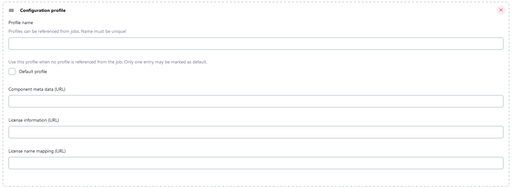

# License Compliance Tool

## Introduction

When you are using open-source third-party software components, you have to conform to their license. For most licenses, this means three things:

1. Attribute that you are using the component and mention its license
2. Make the source code of the component available
3. Include the license terms

While it is not particular difficult to fulfill any of these obligations, doing it manually can become quite tedious if you are using a lot of them.
An in our times, we _are_ using a lot of them - especially if you have a dependency management system like Maven or NPM at hand.

License Compliance Tool helps you to be compliant to license terms by creating a manifest of all used components including their license source code.

## Overview


1. Create a [Software Bill of Materials](#Software Bill of Materials) (SBOM) for your source code.
2. Call the [Jenkins Plugin](#Jenkins Plugin) in your build job to create a component manifest and download the license files.
   You can [configure](#Global configuration) several JSON data sources to improve data quality.
4. Add the component manifest and the license files to your delivery package (e.g. ZIP, WAR, MSI).

## Software Bill of Materials

The main input is a [Software Bill of Materials](https://cyclonedx.org/capabilities/sbom/) (**SBOM**) of the software project.
It must be in the [CycloneDX](https://cyclonedx.org/) format.
It can be created manually, but if you are using a dependency management system, it is more convenient to let it be created for you.
The CycloneDX toolchain supports several dependency management systems, e.g. [Apache Maven](https://github.com/CycloneDX/cyclonedx-maven-plugin)
or [NPM](https://github.com/CycloneDX/cyclonedx-node-npm). Take a look at their [GitHub page](https://github.com/CycloneDX) for a complete list.

## Jenkins Plugin

### Global configuration



#### Component meta data

Use this setting to override existing or add missing attributes to the components of the SBOM.
This is especially useful when you use a SBOM generated from your dependency management system since the resulting data is often incomplete and incorrect.

Enter an URL point to a JSON file containing an array of metadata entries.
Each entry contains regular expressions that are matched against the `group` and `name` attributes of components. At least one of these attributes need to be
set.
Regular expressions follow the [Java style](https://docs.oracle.com/javase/8/docs/api/java/util/regex/Pattern.html).
If both are set, both have to match. The first matching entry wins, so order is important.

Entries have the following attributes:

| Name       | Type            | Required?                | Meaning                                                                                                                                            |
|------------|-----------------|--------------------------|----------------------------------------------------------------------------------------------------------------------------------------------------|
| groupMatch | String          | If nameMatch is not set  | Regular expression for the component's group                                                                                                       |
| nameMatch  | String          | If groupMatch is not set | Regular expression for the component's name                                                                                                        |
| mappedName | String          | Optional                 | Use this name in the component manifest. Otherwise, `group.name` will be used.                                                                     |
| ignore     | Boolean         | Optional                 | If set to `true`, the component will not be included in the manifest                                                                               |
| url        | String          | Optional                 | Overwrite the URL in the manifest which points to a website where the component's source code can be retreived.                                    |
| licenses   | Array of String | Optional                 | Replace the licenses defined in the SBOM                                                                                                           |
| comment    | String | Optional                 | Explanatory comment. Not used during processing. If you maintain these files manually, you can use this field to document the purpose of the entry |

Here are some examples to illustrate what you can do with it:

- Combine all components from group `my.component` into a component named `MyComponent` and add a custom URL

````json
{
  "groupMatch": "my\\.component\\.*",
  "mappedName": "MyComponent",
  "url": "https://github.com/my/MyComponent"
}
````

- Ignore component, e.g. because it is not a third-party component and need not be included in the manifest

````json
{
  "groupMatch": "my\\.component\\.*",
  "ignore": true
}
````

- Override licenses

````json
{
  "groupMatch": "my\\.component\\.*",
  "licenses": [
    "Apache-2.0",
    "LGPL-2.1"
  ]
}
````

#### License information

#### License mapping

### Create manifest

**Prerequisite**: A [Software Bill of Materials](https://cyclonedx.org/capabilities/sbom/) (**SBOM**) of your software project.

### Download licenses

**TODO**
